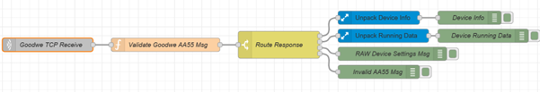

<h1>Goodwe AA55 Status Response Handling Using Node Red
</h1>
        
Goodwe inverters communicate via UDP, by default running on port 8899. The ES/EM/BP inverter family use a native 'AA55' protocol. This Node Red flow receives and un-packages three types of pre-canned AA55 received from the inverter.  

#### Function Code  
0x82 - Device Version Request  
0x86 - Device Running Data Request  
0x89 - Device Status Data Request  

#### Message Structure 

Byte | Value
------------- | -------------
0 | 0xAA
1 | 0x55
2 | Source Address - default is 0x7F
3 | Destination Address - default is 0xC0
4 | Control Code - 0x1
5 | Function Code
6 | Length
7-n | Data 0,1 ..N
n+1 | Checksum
n+2 | Checksum
  
#### Node Red Flow 
 </img>

<footer>

<!--
  <<< Author notes: Footer >>>
  Add a link to get support, GitHub status page, code of conduct, license link.
-->

---

&copy; 2024 GitHub &bull; [Code of Conduct](https://www.contributor-covenant.org/version/2/1/code_of_conduct/code_of_conduct.md) &bull; [MIT License](https://gh.io/mit)

</footer>
